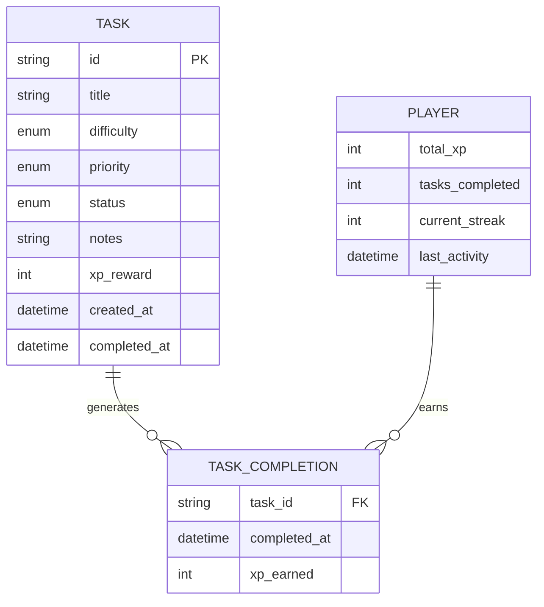

# Design Document - Core Task Management System

## Overview

The Core Task Management System serves as the foundational layer of QUESTA, providing essential CRUD operations for development tasks within a gamified TUI environment. The system is built using Python 3.8+ with the Textual framework for the TUI interface and follows a clean MVC architecture pattern. The design emphasizes type safety, reactive UI updates, and robust data persistence through JSON storage.

The system integrates seamlessly with the gamification mechanics by managing XP rewards, task completion tracking, and player progress updates. All operations are designed to be keyboard-driven and provide immediate visual feedback through the Textual reactive system.

## Architecture

### High-Level Architecture

```
┌─────────────────────────────────────────────────────────────┐
│                    Textual TUI Layer                        │
│  ┌─────────────────┐  ┌─────────────────┐  ┌──────────────┐ │
│  │   Task Screens  │  │  Task Widgets   │  │  Task Forms  │ │
│  │  - QuestsScreen │  │ - TaskListItem  │  │ - AddTask    │ │
│  │  - HomeScreen   │  │ - StatusBadge   │  │ - EditTask   │ │
│  └─────────────────┘  └─────────────────┘  └──────────────┘ │
└─────────────────────────────────────────────────────────────┘
                              │
                              ▼
┌─────────────────────────────────────────────────────────────┐
│                   Business Logic Layer                      │
│  ┌─────────────────┐  ┌─────────────────┐  ┌──────────────┐ │
│  │  TaskManager    │  │  TaskValidator  │  │ XPCalculator │ │
│  │  - CRUD ops     │  │  - Validation   │  │ - XP logic   │ │
│  │  - Status mgmt  │  │  - Business     │  │ - Rewards    │ │
│  │  - Filtering    │  │    rules        │  │              │ │
│  └─────────────────┘  └─────────────────┘  └──────────────┘ │
└─────────────────────────────────────────────────────────────┘
                              │
                              ▼
┌─────────────────────────────────────────────────────────────┐
│                     Data Layer                              │
│  ┌─────────────────┐  ┌─────────────────┐  ┌──────────────┐ │
│  │   Task Model    │  │  Player Model   │  │ DataManager  │ │
│  │  - Task data    │  │  - XP tracking  │  │ - JSON I/O   │ │
│  │  - Enums        │  │  - Statistics   │  │ - Persistence│ │
│  │  - Validation   │  │  - Progress     │  │ - Backup     │ │
│  └─────────────────┘  └─────────────────┘  └──────────────┘ │
└─────────────────────────────────────────────────────────────┘
```

### Design Patterns

1. **Model-View-Controller (MVC)**: Clear separation between data models, UI screens, and business logic
2. **Observer Pattern**: Textual's reactive system for automatic UI updates when data changes
3. **Repository Pattern**: DataManager abstracts data persistence operations
4. **Factory Pattern**: TaskFactory for creating tasks with proper validation and defaults
5. **Strategy Pattern**: Different XP calculation strategies based on task difficulty

## Components and Interfaces

### Core Models

#### Task Model
```python
@dataclass
class Task:
    id: str
    title: str
    difficulty: TaskDifficulty
    priority: TaskPriority
    status: TaskStatus
    notes: Optional[str]
    xp_reward: int
    created_at: datetime
    completed_at: Optional[datetime]
    
    def __post_init__(self):
        # Validation and XP calculation logic
        
    def complete(self) -> int:
        # Mark as completed and return XP earned
        
    def can_transition_to(self, new_status: TaskStatus) -> bool:
        # Validate status transitions
```

#### Enumerations
```python
class TaskDifficulty(Enum):
    EASY = ("Easy", 15)
    MEDIUM = ("Medium", 30) 
    HARD = ("Hard", 50)
    
class TaskPriority(Enum):
    LOW = "Low"
    MEDIUM = "Medium"
    HIGH = "High"
    CRITICAL = "Critical"
    
class TaskStatus(Enum):
    PENDING = "Pending"
    ACTIVE = "Active"
    BLOCKED = "Blocked"
    COMPLETED = "Completed"
```

#### Player Model
```python
@dataclass
class PlayerData:
    total_xp: int = 0
    tasks_completed: int = 0
    current_streak: int = 0
    last_activity: Optional[datetime] = None
    
    @property
    def level(self) -> int:
        # Calculate level based on total XP
        
    @property
    def xp_to_next_level(self) -> int:
        # Calculate XP needed for next level
```

### Business Logic Components

#### TaskManager
```python
class TaskManager:
    def __init__(self, data_manager: DataManager):
        self._data_manager = data_manager
        self._tasks: Dict[str, Task] = {}
        self._player_data: PlayerData = PlayerData()
        
    def create_task(self, title: str, difficulty: TaskDifficulty, 
                   priority: TaskPriority, notes: Optional[str] = None) -> Task:
        # Create and validate new task
        
    def get_tasks(self, status_filter: Optional[TaskStatus] = None) -> List[Task]:
        # Retrieve tasks with optional filtering
        
    def complete_task(self, task_id: str) -> Tuple[Task, int]:
        # Complete task and return task + XP earned
        
    def update_task(self, task_id: str, **updates) -> Task:
        # Update task with validation
        
    def delete_task(self, task_id: str) -> bool:
        # Delete task with safety checks
```

#### TaskValidator
```python
class TaskValidator:
    @staticmethod
    def validate_title(title: str) -> bool:
        # Validate task title requirements
        
    @staticmethod
    def validate_status_transition(current: TaskStatus, new: TaskStatus) -> bool:
        # Validate allowed status transitions
        
    @staticmethod
    def validate_task_data(task_data: dict) -> List[str]:
        # Comprehensive task data validation
```

#### XPCalculator
```python
class XPCalculator:
    @staticmethod
    def calculate_base_xp(difficulty: TaskDifficulty) -> int:
        # Base XP calculation from difficulty
        
    @staticmethod
    def calculate_bonus_xp(task: Task, player: PlayerData) -> int:
        # Calculate any bonus XP (streaks, etc.)
        
    @staticmethod
    def calculate_level(total_xp: int) -> int:
        # Calculate player level from total XP
```

### Data Persistence

#### DataManager
```python
class DataManager:
    def __init__(self, data_dir: Path = Path("data")):
        self.data_dir = data_dir
        self.tasks_file = data_dir / "tasks.json"
        self.player_file = data_dir / "player.json"
        
    def save_tasks(self, tasks: Dict[str, Task]) -> bool:
        # Atomic save of tasks to JSON
        
    def load_tasks(self) -> Dict[str, Task]:
        # Load tasks from JSON with error handling
        
    def save_player_data(self, player_data: PlayerData) -> bool:
        # Save player progress
        
    def load_player_data(self) -> PlayerData:
        # Load player progress with defaults
        
    def create_backup(self) -> bool:
        # Create backup of current data
```

### UI Components

#### TaskListItem Widget
```python
class TaskListItem(Widget):
    def __init__(self, task: Task):
        super().__init__()
        self.task = task
        
    def compose(self) -> ComposeResult:
        # Layout task information with styling
        
    def on_click(self) -> None:
        # Handle task selection
        
    def update_display(self) -> None:
        # Update visual representation
```

#### StatusBadge Widget
```python
class StatusBadge(Widget):
    def __init__(self, status: TaskStatus):
        super().__init__()
        self.status = status
        
    def compose(self) -> ComposeResult:
        # Render status with appropriate styling
```

#### TaskForm Widget
```python
class TaskForm(Widget):
    def __init__(self, task: Optional[Task] = None):
        super().__init__()
        self.task = task  # None for new task, Task for editing
        
    def compose(self) -> ComposeResult:
        # Form fields for task creation/editing
        
    def validate_form(self) -> List[str]:
        # Client-side validation
        
    def get_form_data(self) -> dict:
        # Extract form data
```

## Data Models

### JSON Schema Structure

#### Tasks Data (tasks.json)
```json
{
  "tasks": {
    "task_id_1": {
      "id": "task_id_1",
      "title": "Implement user authentication",
      "difficulty": "MEDIUM",
      "priority": "HIGH", 
      "status": "PENDING",
      "notes": "Use JWT tokens for session management",
      "xp_reward": 30,
      "created_at": "2024-01-15T10:30:00Z",
      "completed_at": null
    }
  },
  "version": "1.0",
  "last_modified": "2024-01-15T10:30:00Z"
}
```

#### Player Data (player.json)
```json
{
  "player": {
    "total_xp": 450,
    "tasks_completed": 15,
    "current_streak": 3,
    "last_activity": "2024-01-15T10:30:00Z"
  },
  "statistics": {
    "easy_tasks_completed": 8,
    "medium_tasks_completed": 5,
    "hard_tasks_completed": 2,
    "total_xp_earned": 450
  },
  "version": "1.0",
  "last_modified": "2024-01-15T10:30:00Z"
}
```

### Data Relationships



## Error Handling

### Error Categories

1. **Validation Errors**: Invalid task data, business rule violations
2. **Data Persistence Errors**: File I/O failures, JSON corruption
3. **UI Errors**: Invalid user input, navigation issues
4. **System Errors**: Memory issues, unexpected exceptions

### Error Handling Strategy

#### TaskError Hierarchy
```python
class TaskError(Exception):
    """Base exception for task-related errors"""
    pass

class TaskValidationError(TaskError):
    """Raised when task data validation fails"""
    pass

class TaskNotFoundError(TaskError):
    """Raised when requested task doesn't exist"""
    pass

class TaskStateError(TaskError):
    """Raised when invalid state transitions are attempted"""
    pass

class DataPersistenceError(TaskError):
    """Raised when data save/load operations fail"""
    pass
```

#### Error Recovery Mechanisms

1. **Graceful Degradation**: Continue operation with reduced functionality
2. **Automatic Backup**: Create backups before risky operations
3. **User Notification**: Clear error messages with suggested actions
4. **Data Recovery**: Attempt to recover from corrupted data files
5. **Rollback Support**: Undo operations that fail partway through

### Error Handling Implementation

```python
class ErrorHandler:
    @staticmethod
    def handle_validation_error(error: TaskValidationError) -> str:
        # Return user-friendly validation message
        
    @staticmethod
    def handle_persistence_error(error: DataPersistenceError) -> bool:
        # Attempt data recovery and backup creation
        
    @staticmethod
    def handle_ui_error(error: Exception) -> None:
        # Log error and show user notification
```

## Testing Strategy

### Testing Pyramid

#### Unit Tests (70%)
- **Model Testing**: Task, PlayerData, Enums validation
- **Business Logic**: TaskManager, TaskValidator, XPCalculator
- **Data Persistence**: DataManager save/load operations
- **Utilities**: Helper functions and calculations

#### Integration Tests (20%)
- **Data Flow**: End-to-end task operations
- **UI Integration**: Widget interactions with business logic
- **File System**: JSON persistence with real files
- **Error Scenarios**: Error handling across components

#### UI Tests (10%)
- **Screen Navigation**: Textual screen transitions
- **User Interactions**: Keyboard shortcuts and form submissions
- **Visual Validation**: Correct display of task information
- **Accessibility**: Keyboard navigation and screen reader support

### Test Implementation

#### Unit Test Example
```python
class TestTaskManager:
    def test_create_task_success(self):
        # Test successful task creation
        
    def test_create_task_invalid_title(self):
        # Test validation error handling
        
    def test_complete_task_awards_xp(self):
        # Test XP award on completion
        
    def test_complete_already_completed_task(self):
        # Test duplicate completion prevention
```

#### Integration Test Example
```python
class TestTaskWorkflow:
    def test_full_task_lifecycle(self):
        # Test create -> edit -> complete -> delete workflow
        
    def test_data_persistence_across_sessions(self):
        # Test data survives app restart
```

### Test Data Management

- **Fixtures**: Predefined task and player data for consistent testing
- **Factories**: Dynamic test data generation
- **Mocking**: Mock external dependencies (file system, time)
- **Cleanup**: Automatic test data cleanup after each test

### Continuous Testing

- **Pre-commit Hooks**: Run tests before code commits
- **CI/CD Integration**: Automated testing on code changes
- **Coverage Reporting**: Maintain >90% code coverage
- **Performance Testing**: Monitor operation performance